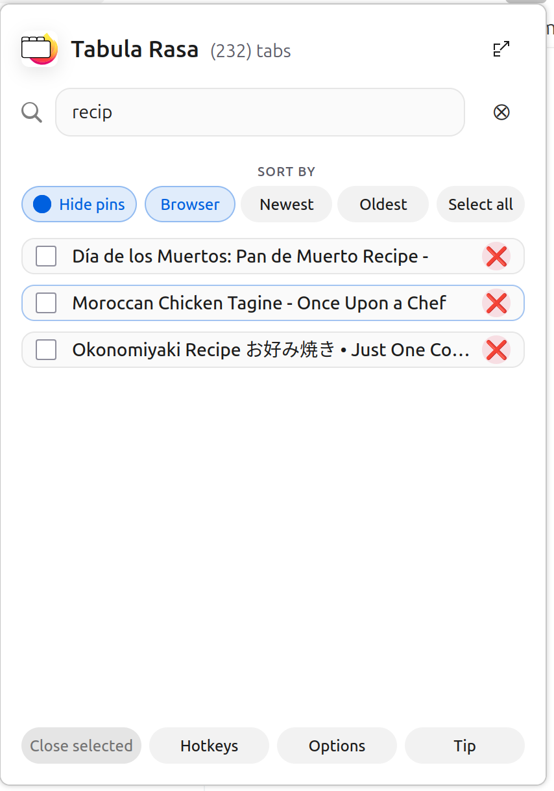

# **Tabula Rasa: Look ma, no mouse!**

Tabula Rasa provides a fast way for navigating, searching, and closing open tabs in your current window. Designed for power users, it minimizes mouse interaction, letting you manage your tab clutter with just a few keystrokes.

The core value is **low-latency tab control**: search, switch, sort, and batch-close tabs instantly—all **using only the keyboard**, eliminating the need for mouse interaction.

## **🚀 Full Keyboard Workflow Example 1**

Follow this step-by-step example to experience the core value of Tabula Rasa—managing your tabs without touching the mouse.

1. **Launch:** Press **F8** (the default hotkey, which you can change in the Options panel).  
2. **Filter/Focus:** Since the search box is focused by default (a configurable option), type a substring like "docs" to filter the list. Then press **Enter** to move the focus from the search box to the list of tabs.  
3. **Navigate:** Use the **J** key to move focus down the list, and the **K** key to move focus up.  
4. **Select Tabs to Close:** When focused on a tab you want to close later, press **Spacebar** to toggle its selection checkbox. Repeat this process for multiple tabs.  
5. **Close Focused Tab:** If you immediately want to close the tab currently in focus, press **X**. The focus automatically shifts to the next tab.  
6. **Switch to Tab:** Find a tab you want to switch to and continue working on. While it's in focus, press **Enter**. Tabula Rasa will close, and your browser will immediately jump to that tab.  
7. **Batch Close:** After relaunching, if you have selected tabs remaining, press **Ctrl/Cmd \+ Enter** to close all selected tabs at once.  
8. **Exit:** Press **Q** to exit Tabula Rasa (works in both popup and full views).

## **🚀 Full Keyboard Workflow Example 2**

1. Launch the app (default key: F8)
2. Press **S** to focus on the search bar (if you're not there already)
3. Type a search query to filter the list.
4. Press **Enter** to go to the tab list.
5. Select the tab you want (using **J/K** to navigate)
6. Press **Enter** for the browser to refocus to that tab.

## **⌨️ Comprehensive Keyboard Shortcuts**

Tabula Rasa is built around hotkeys. Once the tab list has focus (press **Enter** after searching), these shortcuts work:

| Shortcut | Action |
| :---- | :---- |
| **Launch hotkey** | Opens Tabula Rasa (Default: **F8**). |
| **S** / **Esc** | **S** focuses search / **Esc** clears search. |
| **J / K** | Move focus **down** / **up** the list. |
| **Ctrl/Cmd \+ J / K** | Jump to **top** / **bottom** of the list (like Home/End). |
| **Enter** | **Switch to and open** the focused tab. |
| **Space** | Toggle the focused tab’s selection checkbox. |
| **X** | Close the focused tab item. |
| **Ctrl/Cmd \+ Enter** | Close all **selected** tabs. |
| **P** | Hide or show pinned tabs. |
| **A** | Select or clear all **visible** tabs. |
| **1 / 2 / 3** | Switch sorting: Browser / Recent / Oldest. |
| **L** | Toggle horizontal/vertical layout (Full View only). |
| **Q** | Close Tabula Rasa (popup or full view). |

## **👁️ Views at a Glance**

Both views share the same filters and selections, ensuring a seamless experience when switching.

| Popup View | Full View |
| :---- | :---- |
| Quick, compact overlay for immediate navigation and closing. | Spacious layout showing **URL** and **Last Accessed** metadata. |
| Launched via toolbar icon or **F8**. | Opened via **F8** or by clicking **Open full page view (F)**. |

## **⚙️ Customization (Options Panel)**

Access the **Options** panel (press **O** or click the button) to configure persistent preferences:

* **Launch Hotkey:** Change the keyboard shortcut (e.g., F9, Ctrl+Comma).  
* **Default View:** Always open in the full-page layout.  
* **Layout:** Choose between horizontal or vertical split in full view.  
* **Behavior:** Set defaults for hiding pinned tabs, confirming before close, and more.

### **Advanced Hotkey Configuration**

If the built-in hotkey options are insufficient, you can set a fully custom shortcut directly through Firefox’s Add-ons UI under **Keyboard Shortcuts**.

## **📜 History**

The name “Tabula Rasa” is a playful nod to browser **tabs** and the Latin phrase meaning “clean slate,” [tabula rasa](https://en.wiktionary.org/wiki/tabula_rasa). The project began as a quest for a better way to close lots of tabs quickly—wiping the slate clean—but during development it became clear the same keyboard-first interface was equally powerful for **searching** and **navigating** through every open tab. That broadened focus shaped the tool into the all-in-one tab triage and navigation experience it is today. 

## **❤️ Supporting the Author**

Tabula Rasa is a **personal project** built and maintained by the developer during free time.  
If this tool helps streamline your workflow and you appreciate the dedicated effort involved, please consider sending a thank you or a tip. Your support is instrumental in motivating new feature development and ongoing maintenance.  
You can contribute a tip or send a message via the in-app Tip button or directly at:  
[buymeacoffee.com/fejikso](https://buymeacoffee.com/fejikso).

## **📄 License**

Tabula Rasa is released under the GNU General Public License v3.0.
